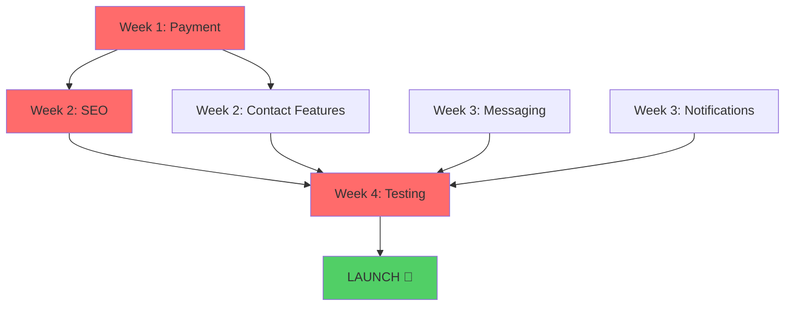

# 🗺️ ThuLoBazaar MVP - Visual Roadmap

## 📊 Current Progress: 75% Complete

```
MVP Completion Progress:
████████████████████████████████████████████████████████████████████████░░░░░░░░░░░░░░░░░░░░░░░░ 75%

✅ Backend:          ████████████████████████████████████████████████ 100%
✅ Database:         ███████████████████████████████████████████████░  95%
✅ Frontend:         ██████████████████████████████████████████░░░░░░  85%
❌ Payment:          ░░░░░░░░░░░░░░░░░░░░░░░░░░░░░░░░░░░░░░░░░░░░░░░░   0%
⚠️  SEO:             ██████░░░░░░░░░░░░░░░░░░░░░░░░░░░░░░░░░░░░░░░░░  20%
⚠️  Messaging:       ███████████████████████████░░░░░░░░░░░░░░░░░░░░  60%
❌ Notifications:    ░░░░░░░░░░░░░░░░░░░░░░░░░░░░░░░░░░░░░░░░░░░░░░░░   0%
⚠️  Testing:         ██████████████░░░░░░░░░░░░░░░░░░░░░░░░░░░░░░░░░  30%
```

---

## 📅 4-Week Sprint to MVP Launch

```
┌─────────────────────────────────────────────────────────────────────────┐
│                          WEEK 1: PAYMENT SYSTEM                         │
│                         🔴 CRITICAL - REVENUE BLOCKER                   │
├─────────────────────────────────────────────────────────────────────────┤
│                                                                          │
│  Monday-Tuesday           Wednesday-Thursday              Friday-Sunday │
│  ┌──────────────┐        ┌──────────────┐              ┌─────────────┐ │
│  │   eSewa      │   →    │   Khalti     │         →    │  Payment UI │ │
│  │ Integration  │        │ Integration  │              │  & Testing  │ │
│  │              │        │              │              │             │ │
│  │ • Merchant   │        │ • API setup  │              │ • Frontend  │ │
│  │   account    │        │ • Webhooks   │              │   modals    │ │
│  │ • API setup  │        │ • Testing    │              │ • E2E tests │ │
│  │ • Webhooks   │        │              │              │ • Staging   │ │
│  └──────────────┘        └──────────────┘              └─────────────┘ │
│                                                                          │
│  Deliverable: ✅ Working payment system with both gateways              │
└─────────────────────────────────────────────────────────────────────────┘

┌─────────────────────────────────────────────────────────────────────────┐
│                      WEEK 2: SEO & FRONTEND POLISH                      │
│                      🔴 CRITICAL - TRAFFIC BLOCKER                      │
├─────────────────────────────────────────────────────────────────────────┤
│                                                                          │
│  Mon-Wed                   Thu-Fri                    Sat-Sun           │
│  ┌──────────────┐        ┌──────────────┐          ┌─────────────┐     │
│  │     SEO      │   →    │   Contact    │     →    │  Dashboard  │     │
│  │  Optimization│        │   Features   │          │  Complete   │     │
│  │              │        │              │          │             │     │
│  │ • SSR setup  │        │ • Phone      │          │ • My Ads    │     │
│  │ • Meta tags  │        │   reveal     │          │ • Favorites │     │
│  │ • Schema.org │        │ • WhatsApp   │          │ • Messages  │     │
│  │ • Sitemap    │        │   button     │          │ • Analytics │     │
│  │              │        │ • Share      │          │             │     │
│  └──────────────┘        └──────────────┘          └─────────────┘     │
│                                                                          │
│  Deliverable: ✅ SEO-ready pages + complete contact features            │
└─────────────────────────────────────────────────────────────────────────┘

┌─────────────────────────────────────────────────────────────────────────┐
│                   WEEK 3: MESSAGING & NOTIFICATIONS                     │
│                        🟡 HIGH PRIORITY - UX                            │
├─────────────────────────────────────────────────────────────────────────┤
│                                                                          │
│  Mon-Wed                   Thu-Fri                    Sat-Sun           │
│  ┌──────────────┐        ┌──────────────┐          ┌─────────────┐     │
│  │  Real-time   │   →    │    Email     │     →    │    Admin    │     │
│  │  Messaging   │        │ Notifications│          │    Panel    │     │
│  │              │        │              │          │             │     │
│  │ • Socket.io  │        │ • SMTP setup │          │ • Payment   │     │
│  │   setup      │        │ • Templates  │          │   reports   │     │
│  │ • Chat UI    │        │ • In-app     │          │ • Analytics │     │
│  │ • Message    │        │   notifs     │          │ • Settings  │     │
│  │   threads    │        │              │          │             │     │
│  └──────────────┘        └──────────────┘          └─────────────┘     │
│                                                                          │
│  Deliverable: ✅ Working chat system + notifications                    │
└─────────────────────────────────────────────────────────────────────────┘

┌─────────────────────────────────────────────────────────────────────────┐
│                    WEEK 4: TESTING & LAUNCH PREP                        │
│                     🔴 CRITICAL - QUALITY GATE                          │
├─────────────────────────────────────────────────────────────────────────┤
│                                                                          │
│  Mon-Tue                  Wed-Fri                     Sat-Sun           │
│  ┌──────────────┐        ┌──────────────┐          ┌─────────────┐     │
│  │   Location   │   →    │   Testing    │     →    │   LAUNCH!   │     │
│  │     Data     │        │   & Fixes    │          │             │     │
│  │              │        │              │          │             │     │
│  │ • KTM wards  │        │ • E2E tests  │          │ • Deploy    │     │
│  │   8-32       │        │ • Mobile     │          │ • Monitor   │     │
│  │ • Lalitpur   │        │ • Browser    │          │ • Fix bugs  │     │
│  │ • Bhaktapur  │        │ • Security   │          │ • Celebrate │     │
│  │ • Pokhara    │        │ • Load tests │          │   🎉        │     │
│  └──────────────┘        └──────────────┘          └─────────────┘     │
│                                                                          │
│  Deliverable: ✅ Production-ready platform launched!                    │
└─────────────────────────────────────────────────────────────────────────┘
```

---

## 🎯 Critical Path Dependencies



**Red = Critical Path** | **Green = Launch**

---

## 📋 Feature Dependency Map

```
┌─────────────────────────────────────────────────────┐
│                  CORE FEATURES                      │
│                   (Must Work)                       │
├─────────────────────────────────────────────────────┤
│                                                      │
│  ┌──────────────────────────────────────────────┐  │
│  │           USER REGISTRATION                  │  │
│  │                    ✅                         │  │
│  └──────────────────┬───────────────────────────┘  │
│                     │                               │
│                     ↓                               │
│  ┌──────────────────────────────────────────────┐  │
│  │           POST AD WITH IMAGES                │  │
│  │                    ✅                         │  │
│  └──────────────────┬───────────────────────────┘  │
│                     │                               │
│                     ↓                               │
│  ┌──────────────────────────────────────────────┐  │
│  │         EDITOR APPROVAL WORKFLOW             │  │
│  │                    ✅                         │  │
│  └──────────────────┬───────────────────────────┘  │
│                     │                               │
│       ┌─────────────┴──────────────┐               │
│       ↓                            ↓               │
│  ┌─────────────┐            ┌─────────────┐        │
│  │  APPROVED   │            │  REJECTED   │        │
│  │     ✅      │            │     ✅      │        │
│  └──────┬──────┘            └─────────────┘        │
│         │                                           │
│         ↓                                           │
│  ┌──────────────────────────────────────────────┐  │
│  │         AD VISIBLE IN SEARCH                 │  │
│  │                    ✅                         │  │
│  └──────────────────┬───────────────────────────┘  │
│                     │                               │
│                     ↓                               │
│  ┌──────────────────────────────────────────────┐  │
│  │          BUYER FINDS AD                      │  │
│  │                    ✅                         │  │
│  └──────────────────┬───────────────────────────┘  │
│                     │                               │
│       ┌─────────────┴──────────────┐               │
│       ↓              ↓             ↓               │
│  ┌─────────┐  ┌──────────┐  ┌──────────┐          │
│  │  Phone  │  │ WhatsApp │  │ In-app   │          │
│  │  Reveal │  │  Button  │  │ Message  │          │
│  │   ❌    │  │    ❌    │  │   ❌     │          │
│  └─────────┘  └──────────┘  └──────────┘          │
│                                                      │
└─────────────────────────────────────────────────────┘

┌─────────────────────────────────────────────────────┐
│           VERIFICATION FEATURES                     │
│            (Revenue Critical)                       │
├─────────────────────────────────────────────────────┤
│                                                      │
│  ┌──────────────────────────────────────────────┐  │
│  │  ALL USERS = INDIVIDUAL SELLERS (FREE)       │  │
│  │  Can post/sell immediately ✅                │  │
│  └──────────────────┬───────────────────────────┘  │
│                     │                               │
│       ┌─────────────┴──────────────┐               │
│       ↓                            ↓               │
│  ┌─────────────┐            ┌─────────────┐        │
│  │  Individual │            │  Business   │        │
│  │ Verification│            │ Verification│        │
│  │ (Blue Badge)│            │(Gold Badge) │        │
│  │     ✅      │            │     ✅      │        │
│  └──────┬──────┘            └──────┬──────┘        │
│         │                          │               │
│         ↓                          ↓               │
│  ┌─────────────┐            ┌─────────────┐        │
│  │  Pay Fee    │            │ Pay NPR     │        │
│  │    ❌       │            │  1,000 ❌   │        │
│  └──────┬──────┘            └──────┬──────┘        │
│         │                          │               │
│         ↓                          ↓               │
│  ┌─────────────┐            ┌─────────────┐        │
│  │  Submit ID  │            │Submit Biz   │        │
│  │  Documents  │            │  License    │        │
│  │     ✅      │            │     ✅      │        │
│  └──────┬──────┘            └──────┬──────┘        │
│         │                          │               │
│         └──────────┬───────────────┘               │
│                    ↓                               │
│  ┌──────────────────────────────────────────────┐  │
│  │      EDITOR MANUAL VERIFICATION              │  │
│  │                    ✅                         │  │
│  └──────────────────┬───────────────────────────┘  │
│                     │                               │
│       ┌─────────────┴──────────────┐               │
│       ↓                            ↓               │
│  ┌─────────────┐            ┌─────────────┐        │
│  │ BLUE BADGE  │            │ GOLD BADGE  │        │
│  │   + Name    │            │+ Biz Name   │        │
│  │   Locked    │            │+ 30-40% off │        │
│  │     ❌      │            │     ❌      │        │
│  └─────────────┘            └─────────────┘        │
│                                                      │
└─────────────────────────────────────────────────────┘
```

---

## 🚦 Feature Status Traffic Lights

| Feature | Status | Blocker | Action |
|---------|--------|---------|--------|
| **Backend API** | 🟢 | None | Ready |
| **Database** | 🟢 | None | Ready |
| **Authentication** | 🟢 | None | Ready |
| **Editor System** | 🟢 | None | Ready |
| **Ad Posting** | 🟢 | None | Ready |
| **Search** | 🟢 | None | Ready |
| **Verification** | 🟢 | None | Ready |
| **Payment** | 🔴 | Critical | **Week 1** |
| **SEO** | 🟡 | High | **Week 2** |
| **Messaging** | 🟡 | High | **Week 3** |
| **Notifications** | 🔴 | Critical | **Week 3** |
| **Contact Features** | 🟡 | Medium | **Week 2** |
| **Location Data** | 🟢 | Minor | **Week 4** |
| **Testing** | 🟡 | High | **Week 4** |

**Legend**: 🟢 Ready | 🟡 In Progress | 🔴 Blocker

---

## 💰 Revenue Flow (Currently Broken ❌)

```
┌─────────────────────────────────────────────────────────────┐
│                    REVENUE STREAMS                          │
├─────────────────────────────────────────────────────────────┤
│                                                              │
│  Stream 1: INDIVIDUAL VERIFICATION (Blue Badge)             │
│  ┌────────────────────────────────────────────────┐        │
│  │                                                 │        │
│  │  User → ❌ Pay Fee (BLOCKED) → Submit ID →     │        │
│  │  → ✅ Editor Approves → ✅ Blue Badge          │        │
│  │                                                 │        │
│  │  Fee: TBD (e.g., NPR 500)                      │        │
│  │  Goal: 500 verifications = NPR 250,000 total   │        │
│  │                                                 │        │
│  └────────────────────────────────────────────────┘        │
│                                                              │
│  Stream 2: BUSINESS VERIFICATION (Gold Badge)               │
│  ┌────────────────────────────────────────────────┐        │
│  │                                                 │        │
│  │  User → ❌ Pay NPR 1,000 (BLOCKED) →           │        │
│  │  → Submit Biz License → ✅ Editor Approves →   │        │
│  │  → ✅ Gold Badge + 30-40% Discount             │        │
│  │                                                 │        │
│  │  Fee: NPR 1,000 (one-time)                     │        │
│  │  Goal: 100 businesses = NPR 100,000 total      │        │
│  │                                                 │        │
│  └────────────────────────────────────────────────┘        │
│                                                              │
│  Stream 3: AD PROMOTIONS                                    │
│  ┌────────────────────────────────────────────────┐        │
│  │                                                 │        │
│  │  User Posts Ad → ❌ Boost Payment (BLOCKED) →  │        │
│  │  → ✅ Ad Promoted (bump/sticky/urgent)         │        │
│  │                                                 │        │
│  │  Regular: NPR 100-500 per promotion            │        │
│  │  Business (30-40% off): NPR 60-350             │        │
│  │  Goal: 200 promotions/mo = NPR 20,000-100,000  │        │
│  │                                                 │        │
│  └────────────────────────────────────────────────┘        │
│                                                              │
│  🔴 CRITICAL: Payment integration BLOCKS all revenue!       │
│  Monthly Target (after 3 months): NPR 300,000+              │
│                                                              │
└─────────────────────────────────────────────────────────────┘
```

---

## 🎯 Success Metrics Dashboard

```
┌───────────────────────────────────────────────────────────────┐
│                   MVP LAUNCH TARGETS                          │
├───────────────────────────────────────────────────────────────┤
│                                                                │
│  WEEK 1 (Soft Launch):                                        │
│  ├── 👥 Users: 50                                             │
│  ├── 📢 Ads: 200                                              │
│  ├── 🏢 Businesses: 5                                         │
│  ├── 💰 Revenue: NPR 5,000                                    │
│  └── 🐛 Critical Bugs: 0                                      │
│                                                                │
│  MONTH 1:                                                     │
│  ├── 👥 Users: 500                                            │
│  ├── 📢 Ads: 2,000                                            │
│  ├── 🏢 Businesses: 50                                        │
│  ├── 💰 Revenue: NPR 50,000                                   │
│  └── 📊 Daily Visitors: 1,000                                 │
│                                                                │
│  MONTH 3:                                                     │
│  ├── 👥 Users: 5,000                                          │
│  ├── 📢 Ads: 20,000                                           │
│  ├── 🏢 Businesses: 200                                       │
│  ├── 💰 Revenue: NPR 200,000                                  │
│  └── 📊 Daily Visitors: 10,000                                │
│                                                                │
│  MONTH 6 (Break Even):                                        │
│  ├── 👥 Users: 20,000                                         │
│  ├── 📢 Ads: 100,000                                          │
│  ├── 🏢 Businesses: 500                                       │
│  ├── 💰 Revenue: NPR 500,000                                  │
│  └── 📊 Daily Visitors: 50,000                                │
│                                                                │
└───────────────────────────────────────────────────────────────┘
```

---

## 🛠️ Daily Task Breakdown (Week 1 Example)

### WEEK 1: PAYMENT INTEGRATION

#### Monday:
```
Morning (4h):
├── ✅ Sign up eSewa merchant account
├── ✅ Get test credentials
├── ✅ Read API documentation
└── ✅ Create backend/services/esewaService.js

Afternoon (4h):
├── ✅ Implement payment initiation
├── ✅ Implement webhook handler
├── ✅ Create payment_transactions table
└── ✅ Test with sandbox
```

#### Tuesday:
```
Morning (4h):
├── ✅ Handle payment success flow
├── ✅ Handle payment failure flow
├── ✅ Update subscription status
└── ✅ Test edge cases

Afternoon (4h):
├── ✅ Create admin payment route
├── ✅ Invoice generation
├── ✅ Payment verification
└── ✅ Integration testing
```

#### Wednesday:
```
Morning (4h):
├── ✅ Sign up Khalti merchant
├── ✅ Get test credentials
├── ✅ Create backend/services/khaltiService.js
└── ✅ Implement payment flow

Afternoon (4h):
├── ✅ Webhook implementation
├── ✅ Payment verification
├── ✅ Database updates
└── ✅ Testing
```

#### Thursday:
```
Morning (4h):
├── ✅ Create PaymentModal.jsx
├── ✅ Create SubscriptionPlans.jsx
├── ✅ Payment gateway selection UI
└── ✅ Form integration

Afternoon (4h):
├── ✅ Payment success page
├── ✅ Payment failure page
├── ✅ Loading states
└── ✅ Error handling
```

#### Friday-Sunday:
```
├── ✅ End-to-end testing
├── ✅ Fix bugs
├── ✅ Deploy to staging
├── ✅ Test with real money (small amounts)
├── ✅ Documentation
└── ✅ Demo video
```

---

## 📱 Mobile vs Desktop Priority

```
┌─────────────────────────────────────────────────┐
│         USER DEVICE BREAKDOWN (Nepal)           │
├─────────────────────────────────────────────────┤
│                                                  │
│  📱 Mobile:  ████████████████████░░  80%        │
│  💻 Desktop: ████░░░░░░░░░░░░░░░░░░  20%        │
│                                                  │
│  🎯 FOCUS: Mobile-first development!            │
│                                                  │
│  Critical Mobile Features:                      │
│  ✅ Responsive layout                           │
│  ✅ Touch-friendly UI                           │
│  ✅ Fast image loading                          │
│  ❌ Click-to-call (phone numbers)               │
│  ❌ WhatsApp deep linking                       │
│  ⚠️  Mobile payment UX                          │
│  ⚠️  Mobile search filters                      │
│                                                  │
└─────────────────────────────────────────────────┘
```

---

## 🎨 UI/UX Completion Status

```
Component Status:
├── 🟢 Header/Navigation          ✅ 100%
├── 🟢 Footer                     ✅ 100%
├── 🟢 Home Page                  ✅ 100%
├── 🟢 Search Results             ✅ 95%
├── 🟡 Ad Detail Page             ⚠️  80% (missing contact buttons)
├── 🟢 Post Ad Form               ✅ 100%
├── 🟢 User Profile               ✅ 100%
├── 🟢 Shop Profile               ✅ 90%
├── 🟡 User Dashboard             ⚠️  70% (missing tabs)
├── 🟡 Editor Dashboard           ⚠️  85% (needs polish)
├── 🔴 Payment Pages              ❌ 0%
├── 🔴 Chat Interface             ❌ 0%
├── 🔴 Notification Center        ❌ 0%
├── 🟢 Auth Modal                 ✅ 100%
├── 🟢 Image Upload               ✅ 100%
└── 🟢 Maps                       ✅ 100%
```

---

## 🔐 Security Checklist

```
✅ IMPLEMENTED:
├── ✅ JWT authentication
├── ✅ Password hashing (bcrypt)
├── ✅ SQL injection prevention (parameterized queries)
├── ✅ XSS protection (input sanitization)
├── ✅ CORS configured
├── ✅ Helmet.js security headers
├── ✅ Rate limiting
├── ✅ Input validation (express-validator)
└── ✅ File upload validation

❌ TODO (Before Launch):
├── ❌ HTTPS/SSL certificate
├── ❌ CSRF tokens for forms
├── ❌ Content Security Policy
├── ❌ Payment webhook signature verification
├── ❌ API rate limiting per user
├── ❌ Security audit
├── ❌ Penetration testing
└── ❌ GDPR compliance check
```

---

## 🚀 Deployment Architecture

```
┌─────────────────────────────────────────────────────────────┐
│                    PRODUCTION SETUP                         │
├─────────────────────────────────────────────────────────────┤
│                                                              │
│  ┌────────────┐    ┌────────────┐    ┌────────────┐        │
│  │   Users    │───→│ CloudFlare │───→│   Nginx    │        │
│  │  (Nepal)   │    │    CDN     │    │  Reverse   │        │
│  │            │    │            │    │   Proxy    │        │
│  └────────────┘    └────────────┘    └─────┬──────┘        │
│                                             │               │
│                     ┌───────────────────────┴──┐            │
│                     ↓                          ↓            │
│              ┌──────────────┐          ┌──────────────┐    │
│              │   Node.js    │          │   Next.js    │    │
│              │   Backend    │          │   Frontend   │    │
│              │  (Port 3000) │          │  (Port 3001) │    │
│              └──────┬───────┘          └──────────────┘    │
│                     │                                       │
│        ┌────────────┴────────────┐                         │
│        ↓            ↓            ↓                         │
│  ┌──────────┐ ┌──────────┐ ┌──────────┐                   │
│  │PostgreSQL│ │  Redis   │ │Typesense │                   │
│  │   DB     │ │  Cache   │ │  Search  │                   │
│  └──────────┘ └──────────┘ └──────────┘                   │
│                                                              │
│  External Services:                                         │
│  ├── eSewa (Payment)                                        │
│  ├── Khalti (Payment)                                       │
│  ├── SendGrid (Email)                                       │
│  └── AWS S3 (Images)                                        │
│                                                              │
└─────────────────────────────────────────────────────────────┘
```

---

## 📞 Emergency Contacts (Set Up Before Launch)

```
┌─────────────────────────────────────────────────┐
│           CRITICAL SERVICES                     │
├─────────────────────────────────────────────────┤
│                                                  │
│  Payment Issues:                                │
│  ├── eSewa Support: support@esewa.com.np        │
│  └── Khalti Support: support@khalti.com         │
│                                                  │
│  Technical Issues:                              │
│  ├── VPS Provider: [Your provider support]      │
│  ├── Database: [Managed DB support]             │
│  └── CDN: [CloudFlare support]                  │
│                                                  │
│  Developer Support:                             │
│  ├── Backend Dev: [Your contact]                │
│  ├── Frontend Dev: [Your contact]               │
│  └── DevOps: [Your contact]                     │
│                                                  │
│  Business:                                      │
│  ├── Domain Registrar: [Support]                │
│  └── Business Bank: [Bank support]              │
│                                                  │
└─────────────────────────────────────────────────┘
```

---

## 🎯 FINAL CHECKLIST BEFORE LAUNCH

```
□ Payments working (eSewa + Khalti)
□ SEO optimized (meta tags, sitemap, SSR)
□ Real-time messaging working
□ Email notifications sending
□ All contact features (phone, WhatsApp, chat)
□ User dashboard complete
□ Admin panel functional
□ Mobile responsive (tested on real devices)
□ SSL certificate installed
□ Domain configured
□ CDN active
□ Database backed up
□ Monitoring tools active (Sentry, uptime)
□ Payment gateways tested with real money
□ All critical bugs fixed
□ Load tested (100+ concurrent users)
□ Security audit passed
□ Terms of Service published
□ Privacy Policy published
□ Contact/Support page ready
□ FAQ page created
□ Launch announcement ready
□ Social media accounts created
□ Initial content/ads seeded
□ Test user accounts created
□ Demo video prepared
□ Press release ready (optional)

WHEN ALL CHECKED: 🚀 LAUNCH!
```

---

**Remember**: This is a marathon, not a sprint. Stay focused on the critical path, and you'll launch in 4 weeks! 💪

**Next Action**: Open `MVP_COMPLETE_PLAN.md` for detailed implementation steps!
